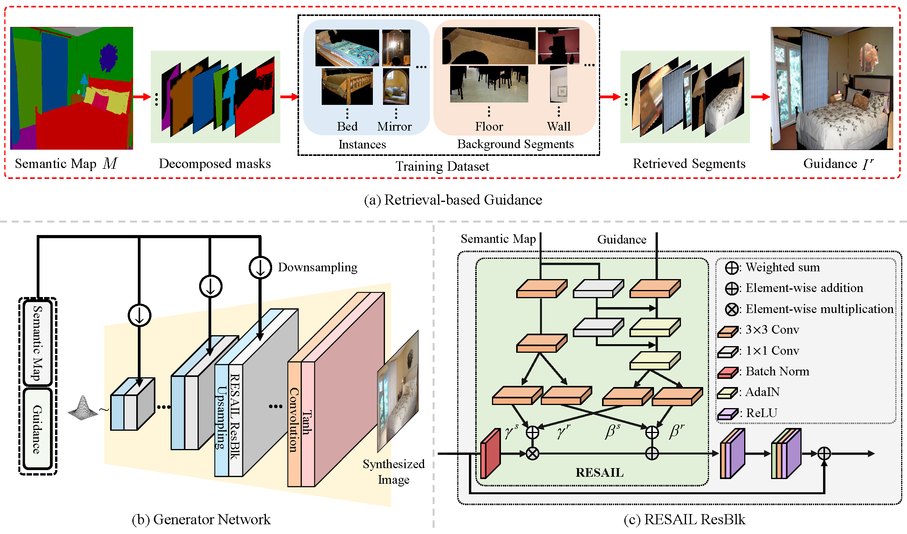

# RESAIL&#x26F5;: Retrieval-based Spatially Adaptive Normalization for Semantic Image Synthesis (CVPR2022)

<div align="center">

</div>


>**Abstract:** _Semantic image synthesis is a challenging task with
many practical applications. Albeit remarkable progress
has been made in semantic image synthesis with spatially-
adaptive normalization, existing methods usually normal-
ize the feature activations under the coarse-level guidance
(e.g., semantic class). However, different parts of a seman-
tic object (e.g., wheel and window of car) are quite differ-
ent in structures and textures, making blurry synthesis re-
sults usually inevitable due to the missing of fine-grained
guidance. In this paper, we propose a novel normaliza-
tion module, termed as REtrieval-based Spatially Adap-
tIve normaLization (RESAIL), for introducing pixel level
fine-grained guidance to the normalization architecture.
Specifically, we first present a retrieval paradigm by find-
ing a content patch of the same semantic class from train-
ing set with the most similar shape to each test seman-
tic mask. Then, the retrieved patches are composited into
retrieval-based guidance, which can be used by RESAIL for
pixel level fine-grained modulation on feature activations,
thereby greatly mitigating blurry synthesis results. More-
over, distorted ground-truth images are also utilized as al-
ternatives of retrieval-based guidance for feature normal-
ization, further benefiting model training and improving vi-
sual quality of generated images. Experiments on several
challenging datasets show that our RESAIL performs favor-
ably against state-of-the-arts in terms of quantitative met-
rics, visual quality, and subjective evaluation._

<div align="center">

</div>

[Paper in arxiv.org]((https://arxiv.org/abs/2204.02854))

- `ADE20K`. 
  - [Download official dataset](http://data.csail.mit.edu/places/ADEchallenge/ADEChallengeData2016.zip) named `ADEChallengeData2016.zip` and unzip this file at the corresponding directory, i.e. `unzip ADEChallengeData2016.zip`.
  - [Download official instance annotations](http://sceneparsing.csail.mit.edu/data/ChallengeData2017/annotations_instance.tar) named `annotations_instance.tar` and extract annotation files at `ADE20K` dataset root, i.e. `tar xvf annotations_instance.tar -C ADEChallengeData2016/` (in the situation where both `ADEChallengeData2016.zip` and `annotations_instance.tar` are downloaded at the same directory). 
  - Directories are organized as follows:
```
ADEChallengeData2016/
    ├── annotations/
    │   ├── training/
    │   │   ├── ADE_train_00000001.png
    │   │   ├── ADE_train_00004043.png
    │   │   ├── ...
    │   │   └── ADE_train_00020210.png
    │   └── validation/
    │       ├── ADE_val_00000001.png
    │       ├── ADE_val_00000401.png
    │       ├── ...
    │       └── ADE_val_00002000.png
    ├── annotations_instance/
    │   ├── training/
    │   │   ├── ADE_train_00000001.png
    │   │   ├── ADE_train_00004043.png
    │   │   ├── ...
    │   │   └── ADE_train_00020210.png
    │   └── validation/
    │       ├── ADE_val_00000001.png
    │       ├── ADE_val_00000401.png
    │       ├── ...
    │       └── ADE_val_00002000.png
    │── images/
    │    ├── training/
    │    │   ├── ADE_train_00000001.jpg
    │    │   ├── ADE_train_00004043.jpg
    │    │   ├── ...
    │    │   └── ADE_train_00020210.jpg
    │    └── validation/
    │       ├── ADE_val_00000001.jpg
    │       ├── ADE_val_00000401.jpg
    │       ├── ...
    │       └── ADE_val_00002000.jpg
    ├── objectInfo150.txt
    └── sceneCategories.txt
```

# _todo_ model's downlongding, preparation of cityscape and brief of train & test